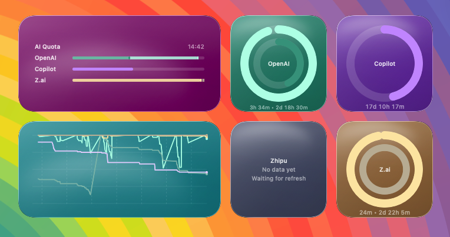

# OpenCodeQuota macOS Widget



macOS desktop widget for opencode that shows AI account quota usage for:

- OpenAI
- Zhipu AI
- Z.ai
- Google Cloud (Antigravity)
- GitHub Copilot

## Requirements

- macOS 14+
- Xcode 15+
- [XcodeGen](https://github.com/yonaskolb/XcodeGen)

## Generate and Run

1. Install XcodeGen if needed:

```bash
brew install xcodegen
```

2. Generate the Xcode project:

```bash
xcodegen generate
```

Or run:

```bash
./scripts/bootstrap.sh
```

3. Open `OpenCodeQuota.xcodeproj` in Xcode.
4. Select your Apple Developer signing team in both targets before running.
5. App Group identifier uses your signing team prefix: `$(TeamIdentifierPrefix)group.ch.lkmc.opencodequota` (must match both entitlements files and runtime resolution in `Shared/SharedConstants.swift`).
6. Run the `OpenCodeQuotaApp` target once, confirm OpenCode credentials are detected, then add the widget.
7. If config files show sandbox permission errors, click `Grant File Access` and select your OpenCode's auth JSON file once.

Widgets refresh from provider APIs on their own timeline, so quota updates continue even when the host app window is closed.
If widgets still show stale data after an update, open the app once and re-run `Grant File Access` so bookmark permissions are synced for the extension.
